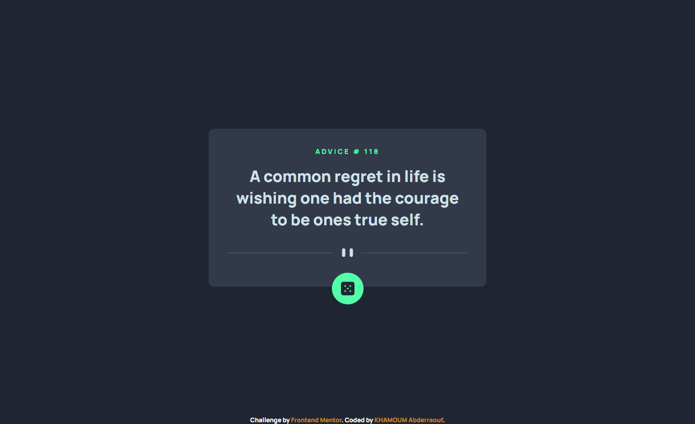

# Frontend Mentor - Advice generator app solution

This is a solution to the [Advice generator app challenge on Frontend Mentor](https://www.frontendmentor.io/challenges/advice-generator-app-QdUG-13db). Frontend Mentor challenges help you improve your coding skills by building realistic projects.
## Table of contents

- [Overview](#overview)
  - [The challenge](#the-challenge)
  - [Screenshot](#screenshot)
  - [Links](#links)
- [My process](#my-process)
  - [Built with](#built-with)
  - [What I learned](#what-i-learned)
- [Author](#author)


## Overview

### The challenge

Users should be able to:

- View the optimal layout for the app depending on their device's screen size
- See hover states for all interactive elements on the page
- Generate a new piece of advice by clicking the dice icon

### Screenshot


-- desktop view

-- mobile view


### Links

- Solution URL: [Github repo](https://github.com/Abderaouf16/Frentend_mentor_challenge_10__-Advice-generator-app)
- Live Site URL: [Live website](https://abderaouf16.github.io/Frentend_mentor_challenge_10__-Advice-generator-app/)

## My process

### Built with

- Semantic HTML5 markup
- CSS custom properties
- Flexbox
- Mobile-first workflow


### What I learned

1-Doing this challenge I learned how to fetch data from an API and hendle the response from it 
2- the second thing that i learned is async function and it 
3- I learned about destructuring assignment in JavaScript to extract specific values from an object.     


``` js
async function getAdvice() {
  const res = await fetch(url);
  const {
    slip: { id, advice },
  } = await res.json();
  adviceNumber.innerText = id;
  AdviceText.innerText = advice;
}
```
```js
 const {
    slip: { id, advice },
  } = await res.json();
```


## Author

- Github - [Abderaouf16](https://github.com/Abderaouf16)
- LinkdeDIN - [KHAMOUM Abderaouf](https://www.linkedin.com/in/abderaouf-khamoum-657527260/)
- Frontend Mentor - [@Abderaouf16](https://www.frontendmentor.io/profile/Abderaouf16)'